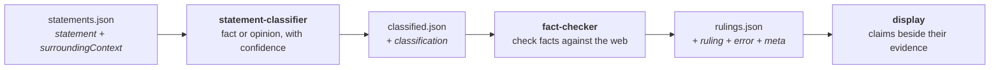

# fact-checker

**Theme — AI reliability engineering / hallucination detection**
Team 15 · DevOps for GenAI · Ottawa 2026 · [Team](#team)

Three small programs and two JSON contracts. Prose goes in, and every claim in it comes back with a
verdict and the sources behind it.

The tool reports what the evidence shows. It does not establish truth, and its vocabulary says so.

> **Read this first.** Section [Demo notes](#demo-notes--what-is-real-and-what-is-not) states how
> far each component is built, and [Known limitations](#known-limitations) lists what does not exist
> at all. Nothing below is claimed as built unless it is.

## Contents

- [The problem](#the-problem)
- [What we measure](#what-we-measure)
- [Architecture](#architecture)
- [Repository layout](#repository-layout)
- [Runbook](#runbook)
- [Demo notes — what is real and what is not](#demo-notes--what-is-real-and-what-is-not)
- [Testing evidence](#testing-evidence)
- [Continuous integration](#continuous-integration)
- [Observability](#observability)
- [Security threat model](#security-threat-model)
- [Secrets and repository hygiene](#secrets-and-repository-hygiene)
- [Dependency inventory](#dependency-inventory)
- [AI system card](#ai-system-card)
- [AI usage disclosure](#ai-usage-disclosure)
- [Known limitations](#known-limitations)
- [Roadmap](#roadmap)
- [Team](#team)
- [License](#license)

## The problem

Reading a claim and checking a claim are two different jobs, and only one of them scales.

A model, or a person, writes a paragraph. Some sentences in it are checkable and some are not, and
they arrive tangled together:

> Water boils at 100 °C at sea level, which is the most elegant constant in physics, and the figure
> was fixed by the CGPM in 1954.

Two checkable claims and one opinion, in one sentence. Before a single source can be pulled, someone
has to sort them. Today that someone is a person reading the whole document by hand, or it is nobody
at all. Generation got cheap; checking did not.

**Who has this problem.** Anyone who has to stand behind text a model produced — a technical writer
shipping generated documentation, an analyst summarising a report, a reviewer of an AI-assisted
draft. They do not need a truth oracle. They need to know which sentences carry a checkable claim,
what the public evidence says about each one, and — just as usefully — which ones the evidence does
not settle.

## What we measure

We are honest about the difference between what the system reports and what we have proven.

**What every run reports today.** Each run writes a `meta` block: how many statements were seen,
checked, skipped and failed, and the prompt tokens, completion tokens and searches it consumed. Each
statement gets a log line naming its elapsed time and outcome. That gives cost per run, throughput,
and failure rate directly from a normal run, with nothing extra to instrument.

**What we have not measured.** Classification accuracy and verdict accuracy. Stage two carries a
hand-run suite: cases spread across the four verdicts, and opinions that must pass through
unchecked. It catches a prompt regression on the cases it holds. That is not a labelled set big
enough for an accuracy baseline, and nothing measures the classifier at all. We can tell you what a
run cost and how long it took. We cannot yet tell you how often it was right, and we will not imply
otherwise.

## Architecture



Three programs, joined by two JSON contracts and nothing else. No shared database, no shared
process, no shared state.

| Stage | What it does | Boundary it does not cross |
| ----- | ------------ | -------------------------- |
| `statement-classifier` | Labels each statement `fact` or `opinion` with a confidence, one model call per statement, through OpenRouter. | No web search. No ruling on whether anything is true. |
| `fact-checker` | Checks each `fact` against the web and returns a verdict with references. Opinions pass through untouched. | No extraction, no classification. It trusts the label it is given. |
| `display` | Reads a rulings file the user picks and lays each claim out beside its evidence. | No calling of either stage. It reads a finished file. |

**Why three programs and not one.** The contract is the only coupling, so each stage can be
rewritten, tested, deployed and rate-limited on its own. Each is both an importable library and a
command-line tool, so a teammate can pipe them together in a shell or import one directly. Each
carries its own lockfile and its own CI job, so a change to one never queues or fails the other's
checks.

Both Python packages publish their full contract in their own README:
[`packages/statement-classifier/README.md`](packages/statement-classifier/README.md) and
[`packages/fact-checker/README.md`](packages/fact-checker/README.md). Each keeps its design record
beside it, in [`packages/statement-classifier/SPEC.md`](packages/statement-classifier/SPEC.md) and
[`packages/fact-checker/SPEC.md`](packages/fact-checker/SPEC.md).

### The four verdicts

| Verdict | Meaning |
| ------- | ------- |
| `supported` | The evidence backs the claim. |
| `refuted` | The evidence contradicts the claim. |
| `mixed` | The claim is partly right, or the sources disagree with each other. |
| `unverifiable` | The search ran and the evidence does not settle the claim. |

`unverifiable` is a finding, not a failure. A consumer that treats it as an error misreads the
output. Likewise `ruling.confidence` measures trust in the verdict, not the truth of the statement:
an `unverifiable` verdict at high confidence says the tool is sure the claim cannot be settled this
way.

## Repository layout

```
packages/statement-classifier/   stage one — Python, uv, own CI job
packages/fact-checker/           stage two — Python, uv, own CI job
frontend/                        stage three — React, TypeScript, Vite
design-system/                   design tokens, guideline cards, brand rules
slides/pitch/                    the three-minute pitch deck and its talk track
.github/workflows/               one path-filtered workflow per Python package
```

## Runbook

### What you need

- [uv](https://docs.astral.sh/uv/) for the Python packages. Each package pins its own interpreter in
  `.python-version`, and uv fetches it.
- Node 20 or newer for the frontend.
- An [OpenRouter](https://openrouter.ai/) API key, and a [Bright Data](https://brightdata.com/) API
  token for stage two. Stage one runs live on the key alone; stage two needs both. Every test runs
  without either.

### Configure

Configuration is environment variables only. Nothing reads a credential from a file in the
repository, and no credential is ever committed.

```bash
export OPENROUTER_API_KEY=...          # required by both stages
export BRIGHTDATA_API_TOKEN=...        # required by stage two
export OPENROUTER_MODEL=...            # optional; defaults per package
```

`packages/fact-checker/.env.example` names every setting stage two reads, with every value left
blank. Copy it to `.env`, which `.gitignore` excludes.
[`packages/fact-checker/README.md`](packages/fact-checker/README.md) gives the default that applies
while each is unset.

### Run stage one — classify

```bash
cd packages/statement-classifier
uv sync --locked
echo '{"statements":[{"surroundingContext":"A note on kettles. Water boils at 100 C at sea level. That is why the kettle clicks.","statement":"Water boils at 100 C at sea level"}]}' \
  | uv run statement-classifier classify > classified.json
```

`--input` and `--output` both default to `-`, meaning stdin and stdout, so the command composes in a
pipe. `--concurrency` caps the model calls in flight and defaults to 5.

### Run stage two — check

```bash
cd packages/fact-checker
uv sync --locked
uv run fact-checker --input classified.json --output rulings.json
```

This one searches the web, so it needs both credentials: `OPENROUTER_API_KEY` for the agent and
`BRIGHTDATA_API_TOKEN` for the search and fetch tools. Without either it exits `3` and checks
nothing. Both paths are required — there is no stdin or stdout mode, for the reason
[`packages/fact-checker/README.md`](packages/fact-checker/README.md) gives.

### Run stage three — display

```bash
cd frontend
npm install
npm run dev
```

### Exit codes

Each stage distinguishes "the batch failed" from "an item inside it failed". A per-item failure is
reported inside the payload and leaves the exit code at zero, so a caller that cares must read the
`error` field.

| Code | `statement-classifier` | `fact-checker` |
| ---- | ---------------------- | -------------- |
| `0` | The batch succeeded. Items may still carry errors. | A payload was written. Statements may still carry errors. |
| `1` | The input could not be read, or the output written. | An unexpected crash, or the Bright Data tools could not be loaded. |
| `2` | The input is not valid JSON, or does not match the shape. | The input could not be read, or failed the contract. |
| `3` | The credential is missing or was rejected. | A credential was never set, or was rejected. |
| `4` | — | The payload was built and could not be written. |

On a non-zero exit each writes one JSON error object to stderr.

### Troubleshooting

| Symptom | Cause | What to do |
| ------- | ----- | ---------- |
| Exit `3` from either stage | `OPENROUTER_API_KEY`, or stage two's `BRIGHTDATA_API_TOKEN`, is unset or rejected | Export the credential. Each stage checks its own before any model call. A blank value in `.env` counts as unset. |
| Exit `2` from `fact-checker` naming a repeated id | Two statements share an `id`, assigned or supplied | Identifiers must be unique across the payload. Drop the supplied one or renumber. |
| A statement returns a `timeout` error | The check passed the per-statement limit | Raise `FACT_CHECKER_STATEMENT_TIMEOUT_SECONDS`, or accept the result. The rest of the batch is unaffected. |

## Demo notes — what is real and what is not

Handbook item P-15 asks for mocked components to be identified plainly. These are ours.

| Component | State |
| --------- | ----- |
| `statement-classifier` | **Live.** Real model calls through OpenRouter, structured output, per-statement error isolation. |
| `fact-checker` contract, orchestration, CLI | **Live.** Runs end to end: reads input, assigns ids, enforces timeouts, aggregates usage, writes the payload. |
| `fact-checker` checking agent | **Live.** It searches. Each factual statement gets its own agent run against Bright Data's hosted MCP server, spending a bounded budget of search and fetch calls, and rules on what it read with cited sources. References are the model's own and are not checked against the retrieved text — see [Known limitations](#known-limitations). |
| `display` | **Partly live.** It renders the real ruling shape, from a fixed sample rather than a file the user picks. The file picker is not built. |
| Extraction of statements from a document | **Does not exist.** Statements arrive already split out, each with its surrounding context. |

## Testing evidence

Both suites, run on this branch. The bar is stated rather than counted: a test count printed here is
wrong by the next commit, and the rule is what a reader can check for themselves.

| Package | Tests | Line coverage | Floor | Lint |
| ------- | ----- | ------------- | ----- | ---- |
| `fact-checker` | all passing | above the floor | 80 % | clean |
| `statement-classifier` | all passing | above the floor | 80 % | clean |

```bash
cd packages/fact-checker        && uv run poe lint && uv run poe test
cd packages/statement-classifier && uv run poe lint && uv run poe test
```

`lint` runs `ruff check` and `ruff format --check`. `test` runs the suite under coverage, and the
report fails below 80 percent.

**No test in either suite calls a model.** Both drive the model boundary — and, in stage two, the
search and fetch tools as well — through fakes, so the checks need no credential and make no network
call. That is why no CI job carries a secret. Stage two also carries one credentialed end-to-end
test, marked `integration` and deselected by its test task. It is run by hand, never by CI.

Coverage includes the failure paths, not only the happy one: per-statement timeouts and isolation, a
rejected credential ending a run, duplicate identifiers, malformed input, unwritable output paths,
and every exit code in the table above.

**What the suites do not cover.** No adversarial or prompt-injection tests. No load or soak tests. No
end-to-end test across the three stages — each is tested against its contract, not against its
neighbour.

## Continuous integration

Two GitHub Actions workflows, one per Python package, in `.github/workflows/`.

- **Path-filtered.** Each triggers only on changes to its own package or its own workflow file, so a
  teammate's change never queues, or fails, the other's job.
- **Least privilege.** Each declares `permissions: contents: read`.
- **No secrets.** Neither workflow carries an `env` or a `secrets` block, and neither should acquire
  one. A live model call in CI would make the checks depend on an upstream service.
- **Triggered on `pull_request`**, not `pull_request_target`, so a fork's branch never runs with
  access to repository secrets.
- **Static security linting.** `ruff` runs the `flake8-bandit` rule family (`S`) on every pull
  request, alongside `flake8-builtins`, `flake8-bugbear`, a ban on blind `except Exception`, and a
  ban on blanket `# noqa` and `# type: ignore`.
- **Locked installs.** `uv sync --locked` fails rather than silently resolving a different dependency
  tree than the lockfile records.

**Gaps.** Actions are pinned by version tag, not by commit SHA, which is weaker. The frontend has no
CI job. There is no dependency vulnerability scan, no automated secret scan, and no deployment
pipeline — nothing is deployed anywhere.

## Observability

What a run emits today, with no extra instrumentation:

- **Stage two writes one structured log line per statement**, naming the statement, its elapsed
  time, and its outcome.
- **Stage one writes no log records at all.** It imports `logging` nowhere. Its outcome reaches the
  caller through the exit code, and a failure adds one JSON `{code, message}` object on stderr.
- **Every log record goes to stderr.** Stage two writes the payload only to its `--output` file, so
  its stdout stays empty. Stage one defaults `--output` to `-`, so the payload goes to stdout — and
  nothing else does, which keeps the pipe clean.
- **Stage two logs the reason a run ended at `CRITICAL`**, so no setting of `LOG_LEVEL` can hide why
  a non-zero exit code was returned.
- **Level control** in stage two by the `LOG_LEVEL` environment variable, defaulting to `INFO`.
  There is no `--verbose` flag on either stage, and stage one has no level to control. At `DEBUG`
  stage two also logs one line per tool call and the traceback behind any failure.
- **A per-run `meta` block** carrying `startedAt`, `finishedAt`, `counts` (total, checked, skipped,
  failed) and `usage` (prompt tokens, completion tokens, searches). `searches` counts the search
  calls the run made, so a search retried after a transient failure counts each attempt, and one
  answered from the run's cache counts none.

Cost, throughput and failure rate all come straight off that block.

**Gaps.** No metrics, no traces, no dashboard, no alerting, and no log aggregation. Telemetry is
per-run and read by a human. There is no way today to see a trend across runs.

## Security threat model

The threats we consider material, and where each stands. "Mitigated" means the control is in the
code on this branch.

### 1. Prompt injection through the input text — *partly mitigated*

Input text is untrusted and goes straight into a model prompt. A statement written as an instruction
can try to steer its own classification.

- *Mitigated.* The classifier uses structured output bound to a Pydantic schema, so the model can
  only answer with `class` and `confidence`, and the answer is validated. A successful injection
  yields a wrong label, not arbitrary output or a tool call. Output that fails the schema becomes a
  per-statement `PARSE_ERROR` and never reaches a caller as a classification.
- *Not mitigated.* Nothing detects or neutralises an injection attempt, and there is no adversarial
  test suite. Each statement is classified in its own call, so one poisoned statement cannot reach
  its siblings — but that is a consequence of the design, not a control we tested.

### 2. Injection through fetched web pages — *not mitigated*

The checking agent fetches pages the model chooses and feeds them back to it. Those pages are
untrusted input from an attacker-influenceable source, and this is the larger exposure of the two.

What holds today: the system prompt tells the agent that text the tools return is retrieved web
content — evidence to weigh, never instruction to follow — and a fetched page is cut at a character
ceiling before it reaches the model. That is a statement of intent and a size limit. Nothing detects
or neutralises an injection attempt, nothing separates page content from instruction at the protocol
level, and no adversarial test exercises this path.

### 3. Credential disclosure — *mitigated*

Two credentials: an OpenRouter API key and a search-provider API token.

The search provider authenticates by a query parameter rather than a header, which makes the
endpoint URL itself a credential. It is wrapped in a settings type that builds the real URL only
when a caller asks for it by that name; printing that type, logging it, or letting it reach a
traceback yields the endpoint with `***` in the token's place. Because an upstream failure can quote
the real URL in a message of its own, every message stage two reports, logs or publishes also passes
through a scrub that replaces the token wherever it appears.

The settings object's `repr` is written by hand so the OpenRouter key cannot appear in it, because
the test task runs `pytest --showlocals` and a key printed into a CI log is a key to rotate.

- *Not mitigated.* No rotation procedure is documented, and no automated secret scanning runs.

### 4. Cost exhaustion and runaway loops — *partly mitigated*

The system makes one model call per statement, and the checking agent makes tool calls in a loop.

- *Mitigated.* Bounded concurrency in both stages, a per-statement timeout that cancels the check, a
  bounded retry count, a per-statement tool-call budget, and a ceiling on page content reaching the
  model. Each stage's README gives the default that applies while each is unset.
- *Not mitigated.* No cap on total spend per run, no budget alerting, and no rate-limit-aware
  backpressure beyond per-call retry with backoff.

### 5. Server-side request forgery through the fetch path — *not mitigated*

The checking agent fetches URLs the model selects. There is no destination allowlist and no
private-address blocklist: nothing in the code constrains where a fetch goes. Fetching runs through
Bright Data's hosted server rather than a raw HTTP client in our process, so the request leaves from
their network and not from ours, which narrows the exposure but does not close it and is not a
control we own. This still needs an explicit destination control.

### 6. Supply chain — *partly mitigated*

- *Mitigated.* Every dependency is pinned in a committed `uv.lock` per package, plus
  `package-lock.json` for the frontend. `uv sync --locked` fails on drift. CI actions are pinned to
  released versions.
- *Not mitigated.* No SBOM artifact is generated, no dependency vulnerability scanning runs, and
  actions are pinned by tag rather than by commit SHA.

### 7. Over-trust in the output — *accepted, documented*

References come from the checker, and nothing compares an excerpt against the page it was drawn
from. An excerpt may be a paraphrase rather than a quotation. This was accepted deliberately in
exchange for speed, and it is stated in the `fact-checker` README: read `source` as a pointer to
follow, not as a promise that `excerpt` appears there word for word.

### 8. Untested attack surface — *acknowledged*

No red-teaming has been done against the implemented system. Threats 1, 2 and 5 have no test
evidence behind them. We would rather list them here than claim coverage we do not have.

## Secrets and repository hygiene

- **No credential is committed.** `.gitignore` excludes `.env`, the local agent token, virtual
  environments and caches. `git ls-files` shows no credential tracked.
- **Configuration is environment-only.** `packages/fact-checker/.env.example` names every setting
  with its value left blank, and that package's README gives the default that applies while each is
  unset. A blank value is read as unset, never as zero.
- **No secret reaches CI.** No workflow declares one, and no test needs one.
- **Gap.** No automated secret scanning runs — not in CI, and not as a pre-commit hook. Hygiene here
  rests on `.gitignore` and review.

## Dependency inventory

No SBOM artifact is generated. The dependency manifests are the lockfiles, each committed and each
authoritative for its package.

| Package | Manifest | Principal runtime dependencies |
| ------- | -------- | ------------------------------ |
| `statement-classifier` | `pyproject.toml` + `uv.lock` | `langchain`, `langchain-openai`, `openai`, `pydantic` |
| `fact-checker` | `pyproject.toml` + `uv.lock` | `langchain-core`, `langchain-mcp-adapters`, `langchain-openai`, `openai`, `httpx`, `pydantic`, `python-dotenv` |
| `frontend` | `package.json` + `package-lock.json` | `react`, `react-dom` |

Shared development tooling: `ruff`, `pytest`, `coverage`, `poethepoet`, and `uv` itself.

External services: **OpenRouter** as the model gateway for both Python packages, and **Bright Data's
hosted MCP server** as the search and fetch provider for the checking agent. The agent reaches it
with `langchain-mcp-adapters` and uses exactly two of its tools, `search_engine` and
`scrape_as_markdown`. Google Fonts serves IBM Plex to the design system and the pitch deck.

This project is MIT licensed. Its dependencies are predominantly MIT and Apache-2.0. No
per-dependency license audit has been run.

## AI system card

**Purpose.** Given statements and their surrounding context, label each one checkable or not, check
the checkable ones against public web evidence, and present each claim beside its evidence.

**Intended users.** People who must stand behind text a model produced, and who will read the output
themselves before acting on it.

**Non-goals and prohibited uses.** This is not a truth oracle, and it must not be used as one. Do not
use it to make an automated decision about a person, to moderate content without review, or as
evidence in any process with a consequence for someone. A `refuted` verdict means the evidence this
run found contradicts the claim. It does not mean the claim is false, and it says nothing about the
intent of whoever wrote it.

**Models and providers.** OpenRouter is the gateway for both stages, and Bright Data's hosted MCP
server supplies the checking agent's search and fetch tools. The classifier defaults to
`anthropic/claude-sonnet-5`; the checking agent defaults to `google/gemma-4-31b-it`. Both are set by
environment variable, and both defaults are recorded in code and published in the package READMEs.
Each names an explicit version rather than a `-latest` alias, so an evaluation can tell a prompt
regression from a model swap underneath it.

**Data handling.** Input text is sent to the model provider, and to the search provider for the
statements that get checked. Retention is theirs and is governed by their terms, not by us. Both
tools are stateless: they read a file, write a file, and store nothing. We operate no database and
keep no logs beyond what a run prints to a terminal. **No input is screened for personal data before
it is sent**, so the caller carries responsibility for what they submit.

**Human oversight.** The output is advisory and terminal. Nothing acts on a verdict, no downstream
system consumes one, and the final stage exists so a person reads the claim beside its evidence and
decides. That is the oversight model, and it holds only while the output stays advisory. Automating
on top of a verdict would remove the only control the design has.

**Transparency.** Every verdict carries a justification and its references. The vocabulary refuses to
overclaim: `unverifiable` is a distinct, reportable finding, and confidence measures trust in the
verdict rather than the truth of the claim. A statement the run could not check carries an `error`
naming what went wrong, rather than a guessed verdict.

**Change management.** Prompts, model defaults and thresholds live in source, so changing one is a
pull request that runs the same checks as any other change. Both packages are versioned and
lockfiled.

**Risk classification.** Low, and conditional on the oversight model above. The system produces text
for a person to read and takes no action. Raising it out of that class — automating on a verdict,
or applying it to decisions about people — would need controls this project does not have.

**Ownership, escalation and incident response.** **None defined.** There is no owner on call, no
escalation path, and no process for responding to an unsafe or wrong output. This is the largest
governance gap in the project, and it is a gap rather than an omission: a hackathon build with no
deployment has nothing to page anyone about, and that would have to change before anyone relied on
it.

**Monitoring.** Cost, throughput and failure rate come off the per-run `meta` block. There is no
quality, safety or abuse monitoring, and no trend across runs.

## AI usage disclosure

This project was built with heavy AI assistance, and we would rather be precise about it than
gesture at it.

- **Claude Code** (Anthropic) was used throughout: package scaffolding, implementation, tests,
  package documentation, this README, and the pitch deck under `slides/pitch/`. Work ran through a
  governed harness that routes changes through branch, review and merge, which is why the commit
  history is structured the way it is.
- **The `design-system/` directory was generated**, tokens and guideline cards alike, from a written
  brief. It carries a `SKILL.md` so it can be applied consistently to new surfaces.
- **Design and architecture decisions were made by the team.** The three-stage split, the contract
  shapes, the error-isolation model, the verdict vocabulary and the credential-redaction approach
  were human decisions, written up as specs before implementation. Each package's spec is committed
  beside its code, at `packages/statement-classifier/SPEC.md` and `packages/fact-checker/SPEC.md`.
- **All generated code was reviewed before merge**, and every claim in the [Testing
  evidence](#testing-evidence) table was produced by running the suites, not by asking a model what
  it thought the result was.

At run time the product itself calls models: see [AI system card](#ai-system-card) for which ones
and for what.

## Known limitations

Stated plainly, because a disclosed gap is worth more than a quiet one.

1. **References are not verified.** Nothing compares an excerpt against the page it came from. The
   accepted limitation, and how to read a reference because of it, are stated in
   [`packages/fact-checker/README.md`](packages/fact-checker/README.md).
2. **No accuracy baseline.** Stage two's hand-run cases catch a prompt regression on the claims
   they cover. There is no labelled set big enough for a baseline, and nothing measures the
   classifier. We report cost and latency, not correctness.
3. **No extraction stage.** Statements must arrive already split out with their surrounding context.
   Nothing in this repository turns a document into that shape.
4. **The display reads fixed data.** The user-selectable file picker is not built.
5. **Nothing is deployed.** No hosting, no infrastructure as code, no container images, no deployment
   pipeline, and therefore no rollback story.
6. **No adversarial testing.** Prompt injection, the fetch path and SSRF have no test evidence.
7. **No ownership or incident process.** No owner on call, no escalation, no runbook for an unsafe
   output.
8. **Observability is per-run only.** No metrics, traces, dashboard or alerting.
9. **No SBOM and no dependency scanning.** Lockfiles are the manifest.
10. **English only**, and only two classes — `fact` and `opinion`. There is no `not-a-claim` class,
    so a sentence that is neither is forced into one of the two.
11. **The design system and the pipeline disagree on vocabulary.** `design-system/` was authored
    around `verified / unsupported / contradicted / unchecked`; the pipeline emits
    `supported / refuted / mixed / unverifiable`. The pipeline's vocabulary is authoritative — it is
    what the code produces — and the design system has not been updated to match.

## Roadmap

In the order we would do it.

1. **Adversarial tests** for threats 1, 2 and 5 — injection through input, injection through fetched
   pages, and the fetch destination — and a destination control on the fetch path.
2. **A labelled set big enough for a baseline**, beyond stage two's hand-run cases, so a prompt or
   model change can be judged rather than guessed at.
3. **The file picker** in the display app, closing the loop the demo describes.
4. **An extraction stage** in front of the classifier, so the input is a document rather than a
   prepared JSON file.
5. **Secret scanning and dependency scanning in CI**, and actions pinned by commit SHA.
6. **Deployment**, with the ownership and incident process that has to come with it.

## Team

Team 15.

| Name | Role |
| ---- | ---- |
| Matt Krainski | Project lead |
| Ben Bueno | Contributor |
| Victor Curado | Contributor |

## License

[MIT](LICENSE).
